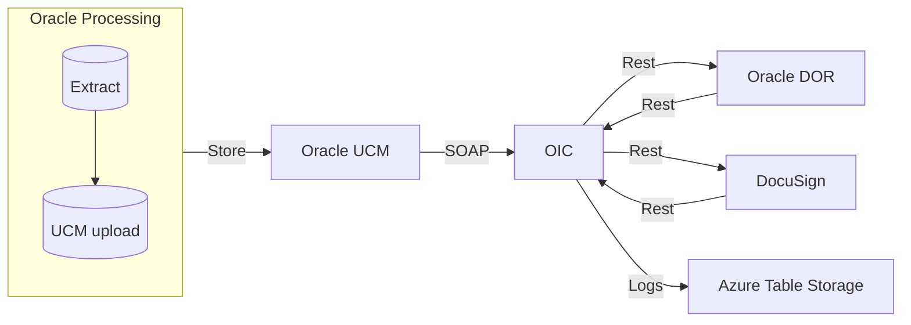

# Runbook: <!-- Integration Name -->

> **Status:**  Active<!-- Draft / Active / Deprecated -->  
> **Version:** 1.0  
> **Last Updated:** 2026-06-25<!-- date -->  
> **Owner:** Dr. Hardy Eich<!-- name -->  
> **On-Call Contact:** Teams<!-- name / channel -->

---

## 1. Purpose

<!-- One paragraph describing what this integration does and why it exists -->
*This runbook defines operational procedures for monitoring, troubleshooting, and maintaining the Oracle Fusion HCM recruiting to DocuSign integration for Offers/Contracts, implemented via Oracle Integration Cloud. It covers daily monitoring, failure handling, re-run procedures, and data validation.*

---

## 2. System Overview

### 2.1 Flow Summary

| Flow | Trigger | Frequency | Purpose |
|---|---|---|---|
| Read contole from UCM <br> OIC/Docusign Project/xxx| scheduled 60 min | hourly | retriev Oracle HCM extract file with offer data|
| Send offer to Docusign<br> OIC/Docusign Project/xxx| on file received trigger | hourly | cread and send DocuSign envelope|
| Store signed offer in Oracle DOR<br> OIC/Docusign Project/xxx| called from Docusign Webhook | hourly | process signed envelope and <br>store signed contract in the original location<br> in Oracle HCM Document of Records|


### 2.2 Architecture



### 2.3 Key Dependencies

| Component | Location | Purpose |
|---|---|---|
| OIC Flow | DDocuSignProject/SendDocumentToDocuSign_Prod_HRUser| Get contract<br> create and Send evelope to DocuSign |
| OIC Flow | DocuSignProject/RetrieveSignedDocFromDocuSign | Store signed doc in DOR|
| OIC Flow | DocuSignProject/TriggerDocusign | get trigger file from UCM |
| <!-- Credential --> | Oracle REST Connection solvias.integration.user| Authentication for Oracle REST |
| <!-- Credential --> | DocuSign Connection hr-docusign@solvias.com| Authentication to DocuSign |
| <!-- Credential --> | OIC callback Connection service.hcm.extract| Authentication for Docusign Webhook |

---
<small>**UCM:** aka webscenter, Oracle Fusion Universal Storage</small><br>
<small>**DOR:** Oracle Fusion HCM Document of Records</small>

---

## 3. Monitoring

### 3.1 Daily Checks

m   

Perform these checks every morning before <!-- time -->:

- [ ] **Daily Teams Digest** DocuSign calls visible in Daily Digest with Success status / error status
- [ ] **OIC Flow Status** → OIC → Integrations → Tracking → last run = `Succeeded`

When HR contacts and is waiting for a signature or needs to correct data

- [ ] in DocuSign (service user hr-docusign@solvias.com review ongoing agrements)

### 3.2 Key Indicators

| Indicator | Expected | Action if breached |
|---|---|---|
| OIC Flow DocuSignProject/RetrieveSignedDocFromDocuSign| no failed instances on working days | Investigate flow 

### 3.3 Where to Look

| Location | What to check |
|---|---|
| OIC → Project DocuSignProject → Observability | Flow execution status |
| Teams → DailyDigest → attached log | Detailed error messages |
| Azure Table `integrationLogs` | Structured run history |

<small>
good entries: <br>
DocuSign  2026-06-25T12:00:03.6370000Z END   WARNING   Empty Control File<br>                                      
DocuSign  2026-06-25T11:29:02.7940000Z END             Document sent for 102144::xx.yy@email.com
</small>

---

## 4. Common Failure Scenarios

### 4.1 Empty Contol File

**Symptoms**
- DailyDigest shows Warning 'Empty Control File'

**Likely causes**
- Scheduled Oracle Extract produces empty control files

**Resolution**
1. Check with HR (Tirza, Nicole) on ongoing contract activies
2. Create control file manually
3. Upload control file to OIC ftp server /inbox/ORC - that will trigger the flow

---

### 4.2 Oracle REST API Failure

**Symptoms**
- OIC DocuSign Project Observability: failed flow RetrieveSignedDocumentFromDocusign - log -> 503 api error
- Oracle HCM -> signed contract not uploaded to Oracle Fusion HCM Document of Records

**Likely causes**
- Service unavailable
- Network issues
- Authentication / password expiry on Oracle REST user

**Resolution**
1. Check error message in OIC instance detail
4. If auth issue → check credential expiry — see [credential-management.md](https://github.com/hardyeich/hris-integration-azure/blob/main/docs/credentialManagement.md)
3. In docusign Admin - push the signed envelope again DocuSign -> Admin -> Connect (Webhooks) -> Dashboard -> Select envelope -> Republish

---

### 4.3 Mapping Failure

**Symptoms**
- eMail addresses in the signing flow do not match expectations (HR will call)

**Likely causes**
- Data extract by MASTEK picked up offer instead of hiring team
- Hiring team manager is not supposed to sign but manager

**Resolution**
1. DocuSign with admin user (hr-docusign@solvias.com)
2. Open envelope, correct, update emails, contract if needed and provided by HR
3. Resend

---

## 5. Re-Run Procedures

### 5.1 Forced Reprocessing - Send

**When to use:** Failed run, Envelope not sent

**Steps:**
1. Download the control (csv) file and correct if necessary
2. Upload the control file again to s-solvias-test-zrge4tdafpud-zr.integration.eu-zurich-1.ocp.oraclecloud.com:10121/inbox/ORC<br>
this will trigger the sending flow automatically
3. Monitor instance in OIC Tracking

**Behavior:** Control file is reprocessed as if new

---

### 5.2 Forced Reprocessing - Receive

**When to use:** Signed Contract is not received and stored in Oracle HCM Document of Recors

**Steps:**
1. Identify and fix the error (if Oracle API 503 - just rerun)
2. Log into Docusign and 're-push' the signed envelope
3. See 4.2.3 for deails

---

## 6. Data Validation

n/a
<!--
When raising an issue or escalating, collect:

- **Run date:** `YYYY-MM-DD`
- **Flow name:** `flow`
- **Error message:** *(copy from OIC logs)*
- **Sample employee:** PersonNumber / SAM
- **OIC instance ID:** *(from Tracking page URL)*
- **Payload:** *(if available and not sensitive)*
-->
---

## 7. Maintenance

### 7.1 Weekly

- [ ] Review error logs and warning counts
- [ ] Spot-check flow success in OIC / DocuSign
- [ ] After credential rotation: verify next flow succeeds end-to-end

---

## 8. Known Limitations

| Limitation | Impact | Workaround |
|---|---|---|
| Persistent Oracle REST upload Error | Download signed document from DocuSign and upload to Oracle DOR through UI | On HR team demand |

---

## 9. Escalation

Escalate to Mastek if:
- control file contains invalid data

**Escalation path:**
```
L1: Hardy
L2: Mastek
L3: Oracle SR
```

---

## 10. Quick Reference

| Task | Action |
|---|---|
| Re-run send | Trigger flow in OIC through control file upload|
| Re-run receive | Trigger 'send envelope' in DocuSign
| Check failure | OIC → Project DocuSignProject  → Observability |
| Check mapping | DocuSign Agreement|
| Rotate credential | See [credential-management.md](https://github.com/hardyeich/hris-integration-azure/blob/main/docs/credentialManagement.md) |
| Raise Oracle SR | [support.oracle.com](https://support.oracle.com) |

---

## 11. Change Log

| Date | Version | Change | Author |
|---|---|---|---|
| <!-- date --> | 1.0 | Initial version | <!-- name --> |
| <!-- date --> | <!-- ver --> | <!-- change --> | <!-- name --> |

